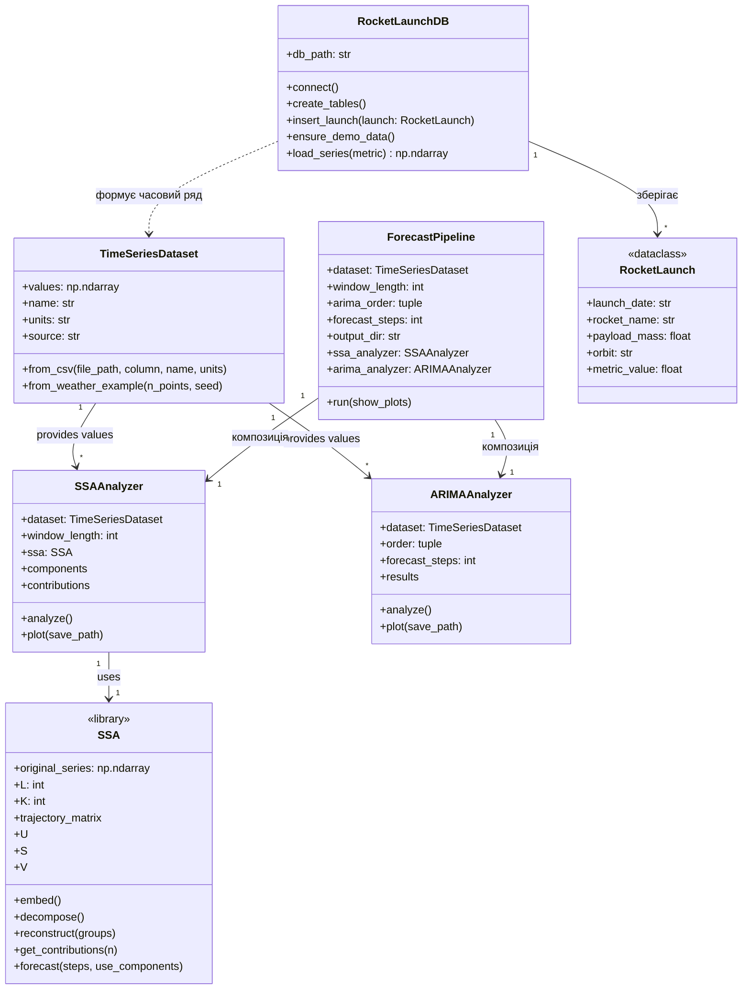
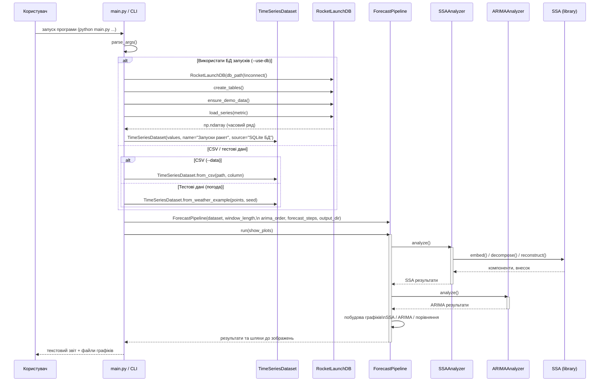
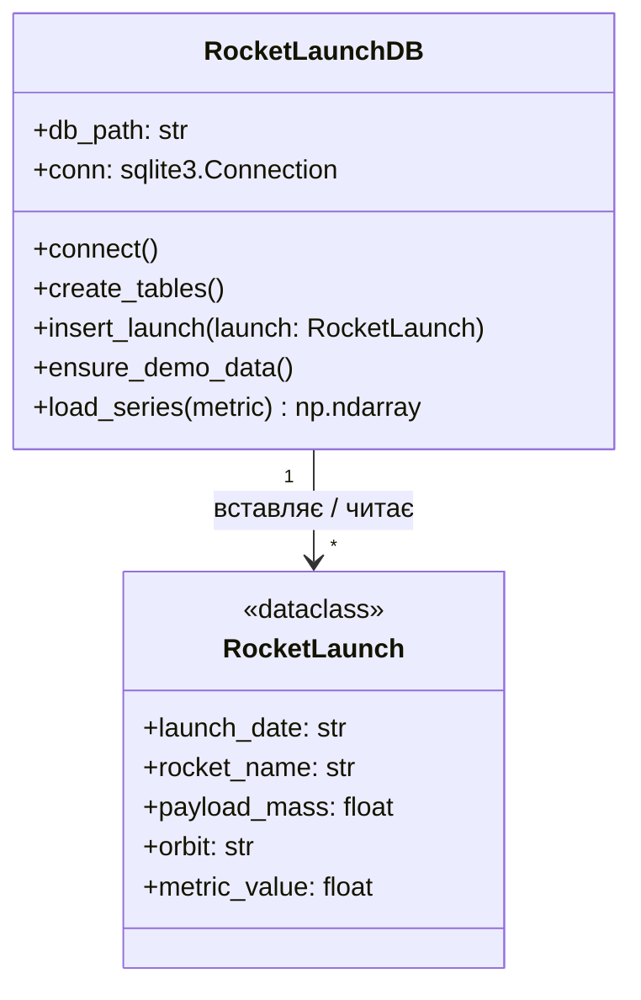
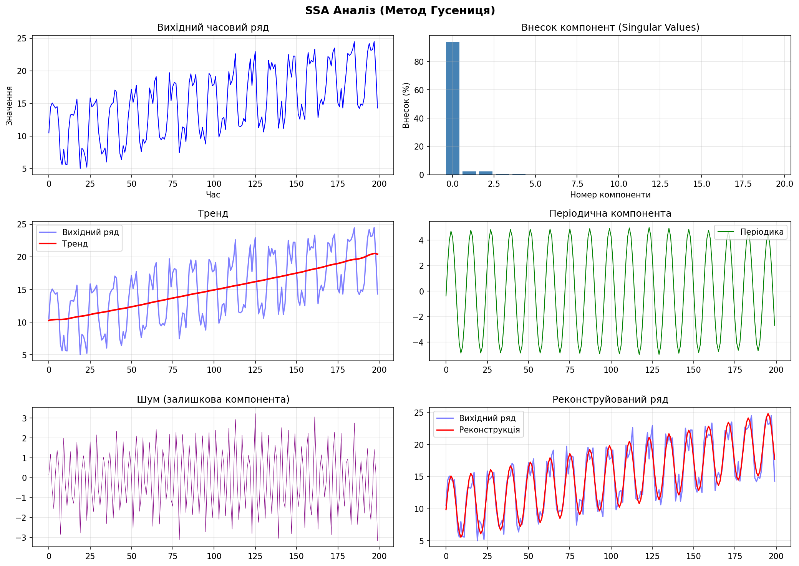
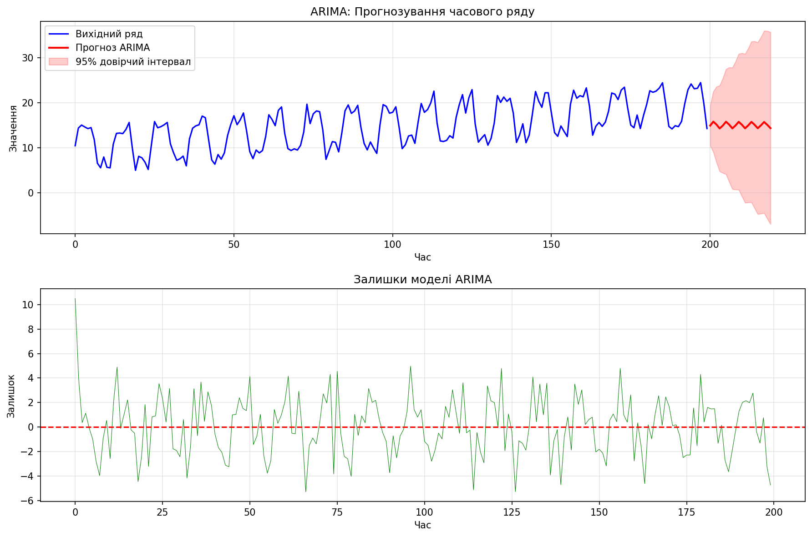
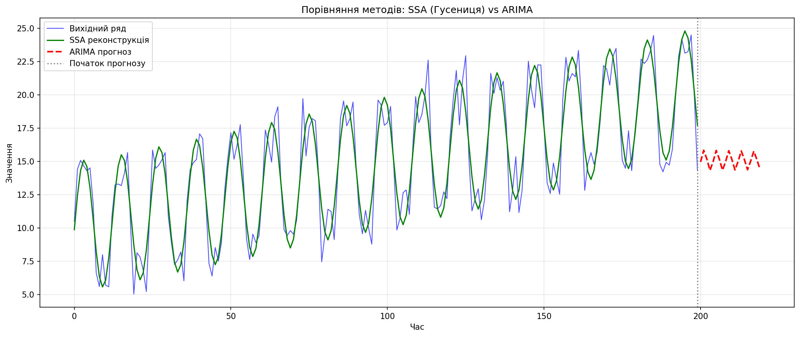

# SSA та ARIMA Аналіз Часових Рядів

Програма для аналізу часових рядів методами **SSA (Singular Spectrum Analysis)** — також відомий як метод **"Гусениця" (Caterpillar)** — та **ARIMA**.

## Встановлення залежностей

```bash
pip install numpy pandas matplotlib scipy statsmodels
```

або

```bash
pip install -r requirements.txt
```

## Запуск

### Базовий запуск (з тестовими даними)

```bash
python main.py
```

### Запуск з власними даними

```bash
python main.py --data my_data.csv --column price
```

## Параметри командного рядка

| Параметр | Тип | За замовчуванням | Опис |
|----------|-----|------------------|------|
| `--data` | str | None | Шлях до CSV файлу з даними |
| `--column` | str | None | Назва стовпця з даними в CSV (якщо не вказано — перший стовпець) |
| `--points` | int | 200 | Кількість точок для генерації тестових даних |
| `--seed` | int | 42 | Seed для генератора випадкових чисел |
| `--window` | int | 50 | Довжина вікна L для SSA аналізу |
| `--arima-p` | int | 2 | Параметр p для ARIMA (порядок авторегресії) |
| `--arima-d` | int | 1 | Параметр d для ARIMA (порядок інтегрування) |
| `--arima-q` | int | 2 | Параметр q для ARIMA (порядок ковзного середнього) |
| `--forecast` | int | 20 | Кількість кроків прогнозу |
| `--output-dir` | str | . | Директорія для збереження графіків |
| `--no-plots` | flag | False | Не показувати графіки (тільки зберегти) |
| `--use-db` | flag | False | Використати базу даних SQLite замість CSV/тестових даних |
| `--db-path` | str | rockets.db | Шлях до файлу бази даних SQLite |
| `--db-metric` | str | count_per_year | Метрика для побудови ряду: `count_per_year` або `avg_payload_per_year` |

## Приклади використання

### Генерація 500 точок з іншим seed

```bash
python main.py --points 500 --seed 123
```

### SSA з більшим вікном

```bash
python main.py --window 100
```

### ARIMA(1,1,1) з прогнозом на 50 кроків

```bash
python main.py --arima-p 1 --arima-d 1 --arima-q 1 --forecast 50
```

### Збереження графіків в окрему папку без показу

```bash
python main.py --output-dir ./results --no-plots
```

### Повний приклад з власними даними

```bash
python main.py --data sales.csv --column revenue --window 30 --arima-p 2 --arima-d 1 --arima-q 1 --forecast 12 --output-dir ./output
```

### Використання бази даних запусків ракет

```bash
python main.py --use-db --db-path rockets.db --db-metric count_per_year --window 30 --forecast 20
```

## Архітектура програми

Програма побудована за модульним принципом з чітким розділенням відповідальності між компонентами.

### Діаграма класів



### Діаграма послідовності (основний сценарій)



### Діаграма модуля роботи з базою даних



## Структура проекту

```
.
├── main.py                 # Головна програма з CLI інтерфейсом
├── ssa_caterpillar.py      # Бібліотека реалізації методу SSA (Гусениця)
├── rocket_db.py            # Модуль роботи з базою даних запусків ракет
├── requirements.txt        # Залежності Python
├── README.md              # Документація проекту
├── uml_classes.mmd         # Діаграма класів (Mermaid)
├── uml_sequence_main.mmd   # Діаграма послідовності (Mermaid)
├── uml_db_detail.mmd       # Діаграма БД (Mermaid)
└── *.png                   # Згенеровані графіки результатів
```

## Результати

### SSA Аналіз (Метод Гусениця)

Декомпозиція часового ряду на тренд, періодичні компоненти та шум:



### ARIMA Прогнозування

Прогноз з 95% довірчим інтервалом та аналіз залишків:



### Порівняння методів

SSA реконструкція vs ARIMA прогноз:



## Вихідні файли

Програма генерує три графіки:

- `ssa_results.png` — результати SSA аналізу (тренд, періодика, шум, реконструкція)
- `arima_results.png` — результати ARIMA (прогноз з довірчим інтервалом, залишки)
- `comparison.png` — порівняння методів SSA та ARIMA

## Опис методів

### SSA (Метод Гусениця)

Сингулярний спектральний аналіз розкладає часовий ряд на компоненти:

1. **Вкладення (Embedding)** — побудова траєкторної матриці ковзним вікном
2. **SVD розкладання** — сингулярне розкладання матриці
3. **Групування** — об'єднання компонент за змістом
4. **Реконструкція** — відновлення ряду з обраних компонент

Виділяє: тренд, періодичні компоненти, шум.

### ARIMA

ARIMA(p, d, q) — авторегресійна інтегрована модель ковзного середнього:

- **p** — порядок авторегресії (AR)
- **d** — порядок інтегрування (диференціювання)
- **q** — порядок ковзного середнього (MA)

Використовується для прогнозування часових рядів.

## Формат вхідних даних

CSV файл з одним стовпцем числових значень:

```csv
value
10.5
11.2
12.1
...
```

або з декількома стовпцями (вкажіть потрібний через `--column`):

```csv
date,temperature,humidity
2024-01-01,15.2,65
2024-01-02,14.8,70
...
```

## Середовище розробки

- **Мова:** Python 3.x
- **Бібліотеки:** numpy, pandas, matplotlib, scipy, statsmodels, sqlite3
- **Архітектура:** Модульна з розділенням відповідальності між компонентами
- **Бібліотека SSA:** Власна реалізація методу Caterpillar-SSA (`ssa_caterpillar.py`)

## Додаткова інформація

### Робота з базою даних

Програма підтримує роботу з базою даних SQLite для зберігання та аналізу даних про запуски ракет-носіїв. База даних автоматично створюється при першому запуску з параметром `--use-db` і заповнюється демонстраційними даними, якщо вона порожня.

Доступні метрики для побудови часового ряду:
- `count_per_year` — кількість запусків на рік
- `avg_payload_per_year` — середня маса корисного навантаження на рік
