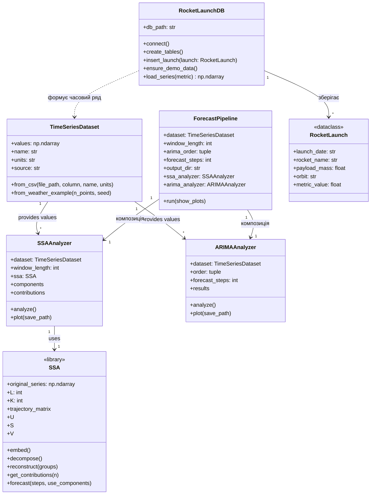
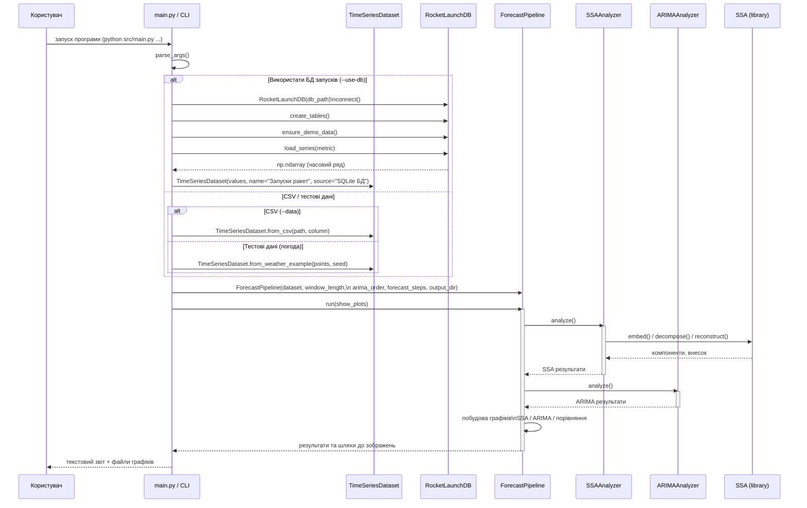
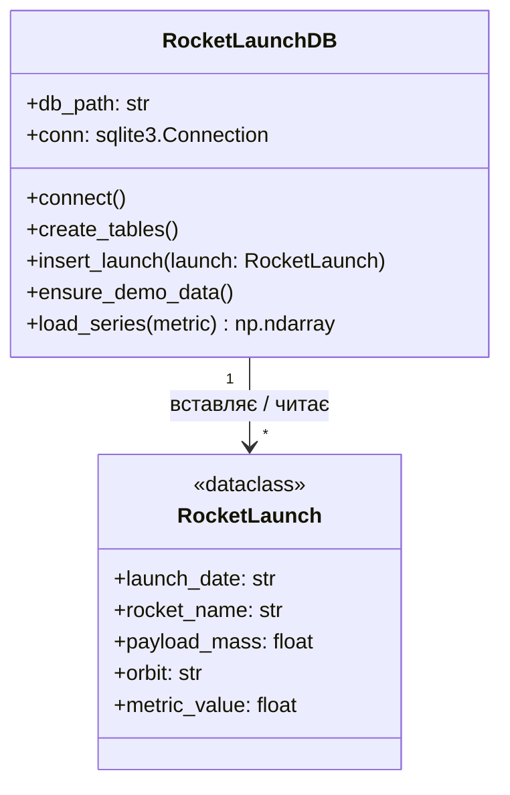
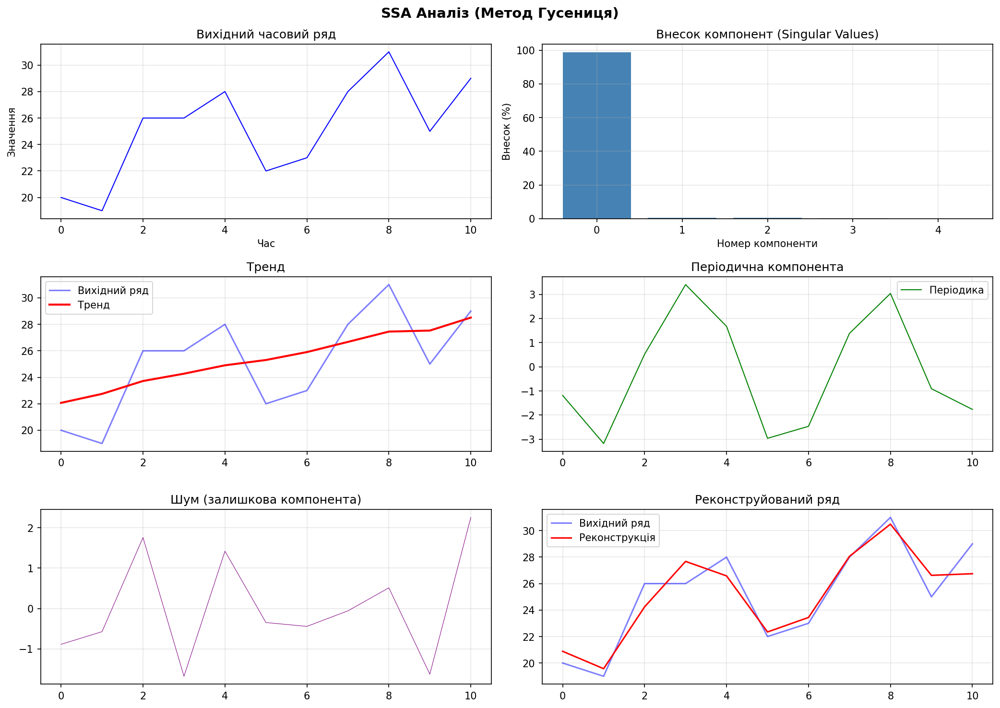
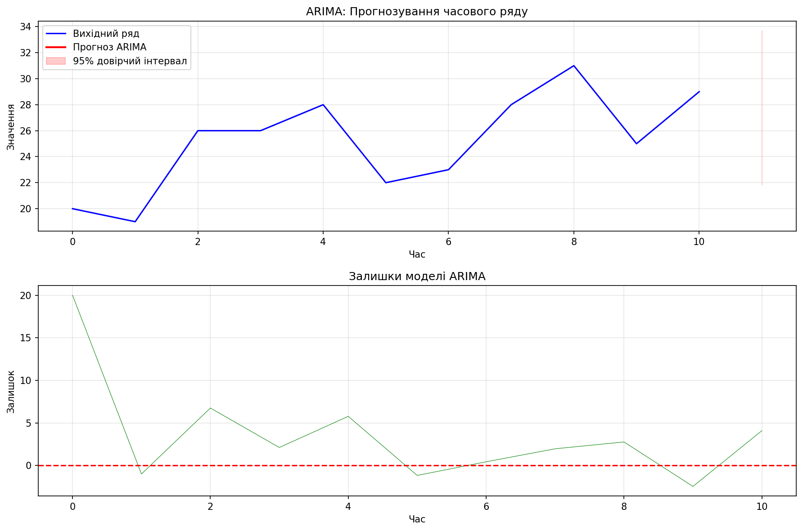
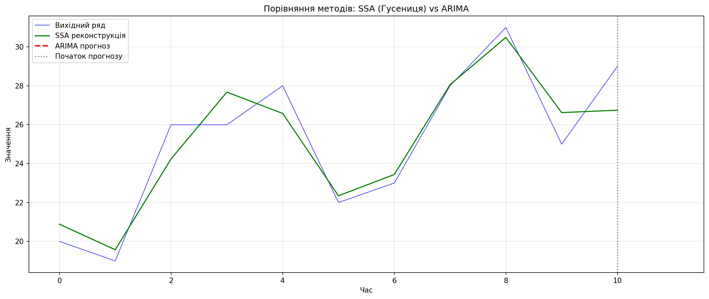

# SSA та ARIMA Аналіз Часових Рядів

Програма для аналізу часових рядів методами **SSA (Singular Spectrum Analysis)** — також відомий як метод **"Гусениця" (Caterpillar)** — та **ARIMA**.

## Встановлення залежностей

```bash
pip install numpy pandas matplotlib scipy statsmodels
```

або

```bash
pip install -r requirements.txt
```

## Запуск

### Базовий запуск (з тестовими даними)

```bash
python src/main.py
```

### Запуск з власними даними

```bash
python src/main.py --data my_data.csv --column price
```

## Параметри командного рядка

| Параметр | Тип | За замовчуванням | Опис |
|----------|-----|------------------|------|
| `--data` | str | None | Шлях до CSV файлу з даними |
| `--column` | str | None | Назва стовпця з даними в CSV (якщо не вказано — перший стовпець) |
| `--points` | int | 200 | Кількість точок для генерації тестових даних |
| `--seed` | int | 42 | Seed для генератора випадкових чисел |
| `--window` | int | 50 | Довжина вікна L для SSA аналізу |
| `--arima-p` | int | 2 | Параметр p для ARIMA (порядок авторегресії) |
| `--arima-d` | int | 1 | Параметр d для ARIMA (порядок інтегрування) |
| `--arima-q` | int | 2 | Параметр q для ARIMA (порядок ковзного середнього) |
| `--forecast` | int | 20 | Кількість кроків прогнозу |
| `--output-dir` | str | results | Директорія для збереження графіків (створюється автоматично) |
| `--no-plots` | flag | False | Не показувати графіки (тільки зберегти) |
| `--use-db` | flag | False | Використати базу даних SQLite замість CSV/тестових даних |
| `--db-path` | str | data/rockets.db | Шлях до файлу бази даних SQLite (за замовчуванням: data/rockets.db) |
| `--db-metric` | str | count_per_year | Метрика для побудови ряду: `count_per_year`, `avg_payload_per_year`, `count_per_month`, `count_per_month_2025` |
| `--forecast-december-2025` | flag | False | Спрогнозувати дані по пусках ракет на грудень 2025 року |

## Приклади використання

### Генерація 500 точок з іншим seed

```bash
python src/main.py --points 500 --seed 123
```

### SSA з більшим вікном

```bash
python src/main.py --window 100
```

### ARIMA(1,1,1) з прогнозом на 50 кроків

```bash
python src/main.py --arima-p 1 --arima-d 1 --arima-q 1 --forecast 50
```

### Збереження графіків в окрему папку без показу

```bash
python src/main.py --output-dir ./results --no-plots
```

### Повний приклад з власними даними

```bash
python src/main.py --data sales.csv --column revenue --window 30 --arima-p 2 --arima-d 1 --arima-q 1 --forecast 12 --output-dir ./output
```

### Використання бази даних запусків ракет

```bash
python src/main.py --use-db --db-metric count_per_year --window 30 --forecast 20
```

База даних автоматично створюється в папці `data/rockets.db` (або за вказаним шляхом через `--db-path`).

### Прогноз на грудень 2025 року

Для прогнозування кількості запусків ракет на грудень 2025 року використовуйте:

```bash
python src/main.py --use-db --forecast-december-2025 --db-metric count_per_month_2025 --window 5 --forecast 1
```

Програма проаналізує дані за 11 місяців 2025 року (січень-листопад) та спрогнозує кількість запусків на грудень, використовуючи методи SSA та ARIMA.

**Результати зберігаються в папці `results/`:**
- `ssa_results.png` - результати SSA аналізу
- `arima_results.png` - результати ARIMA прогнозування
- `comparison.png` - порівняння методів
- `command.txt` - інформація про використану команду та параметри

## Архітектура програми

Програма побудована за модульним принципом з чітким розділенням відповідальності між компонентами.

### Діаграма класів



### Діаграма послідовності



### Діаграма модуля роботи з базою даних



## Структура проекту

```
.
├── src/
│   ├── main.py                 # Головна програма з CLI інтерфейсом
│   ├── database/
│   │   ├── __init__.py
│   │   ├── rocket_db.py        # Модуль роботи з базою даних запусків ракет
│   │   ├── launches_2025__01-11.csv  # CSV дані за січень-листопад 2025
│   │   └── launches_2025-11.csv      # CSV дані за листопад 2025
│   └── ssa/
│       ├── __init__.py
│       └── caterpillar.py      # Бібліотека реалізації методу SSA (Гусениця)
├── data/                         # База даних (створюється автоматично)
│   └── rockets.db               # SQLite база даних
├── diagrams/
│   ├── uml_classes.mmd         # Діаграма класів (Mermaid)
│   ├── uml_sequence_main.mmd   # Діаграма послідовності (Mermaid)
│   └── uml_db_detail.mmd       # Діаграма БД (Mermaid)
├── results/                      # Згенеровані графіки та результати
│   ├── ssa_results.png
│   ├── arima_results.png
│   ├── comparison.png
│   └── command.txt              # Інформація про використану команду
├── requirements.txt              # Залежності Python
└── README.md                    # Документація проекту
```

## Результати

### SSA Аналіз (Метод Гусениця)

Декомпозиція часового ряду на тренд, періодичні компоненти та шум:



### ARIMA Прогнозування

Прогноз з 95% довірчим інтервалом та аналіз залишків:



### Порівняння методів

SSA реконструкція vs ARIMA прогноз:



## Вихідні файли

Програма генерує графіки та інформацію про запуск (за замовчуванням зберігаються в каталозі `results/`, який створюється автоматично; шлях можна змінити прапорцем `--output-dir`):

- `ssa_results.png` — результати SSA аналізу (тренд, періодика, шум, реконструкція)
- `arima_results.png` — результати ARIMA (прогноз з довірчим інтервалом, залишки)
- `comparison.png` — порівняння методів SSA та ARIMA
- `command.txt` — інформація про використану команду, параметри та результати запуску

## Опис методів

### SSA (Метод Гусениця)

Сингулярний спектральний аналіз розкладає часовий ряд на компоненти:

1. **Вкладення (Embedding)** — побудова траєкторної матриці ковзним вікном
2. **SVD розкладання** — сингулярне розкладання матриці
3. **Групування** — об'єднання компонент за змістом
4. **Реконструкція** — відновлення ряду з обраних компонент

Виділяє: тренд, періодичні компоненти, шум.

### ARIMA

ARIMA(p, d, q) — авторегресійна інтегрована модель ковзного середнього:

- **p** — порядок авторегресії (AR)
- **d** — порядок інтегрування (диференціювання)
- **q** — порядок ковзного середнього (MA)

Використовується для прогнозування часових рядів.

## Формат вхідних даних

### Статистичні дані в CSV форматі

Програма працює зі статистичними даними про запуски ракет-носіїв, які зберігаються у форматі CSV. Ці дані містять інформацію про часові ряди запусків ракет, що використовуються для аналізу та прогнозування.

CSV файли з даними про запуски ракет повинні містити наступні стовпці:
- `launcher` - назва ракети-носія
- `date` - дата запуску (формат: YYYY-MM-DD або YYYY-MM-DDTHH:MM:SSZ)
- `payload` - назва корисного вантажу
- `orbit` - тип орбіти
- `status` - статус запуску (Success/Failure)

Приклад CSV файлу з даними про запуски:

```csv
launcher,date,payload,orbit,status
Falcon 9 Block 5,2025-01-04T01:27:00Z,Thuraya 4-NGS,Geostationary Transfer Orbit,Success
Long March 3B/E,2025-01-06T20:00:00Z,Shijian 25,Geostationary Transfer Orbit,Success
...
```

### Загальний формат CSV для часових рядів

CSV файл з одним стовпцем числових значень:

```csv
value
10.5
11.2
12.1
...
```

або з декількома стовпцями (вкажіть потрібний через `--column`):

```csv
date,temperature,humidity
2024-01-01,15.2,65
2024-01-02,14.8,70
...
```

### Робота з базою даних

Програма автоматично завантажує дані з CSV файлів у базу даних SQLite для нормалізованого зберігання та ефективного аналізу. Це дозволяє:
- Зберігати великі обсяги даних про запуски ракет
- Швидко виконувати запити для побудови часових рядів
- Аналізувати дані за різними метриками (кількість запусків, середня маса вантажу тощо)

## Середовище розробки

- **Мова:** Python 3.x
- **Бібліотеки:** numpy, pandas, matplotlib, scipy, statsmodels, sqlite3
- **Архітектура:** Модульна з розділенням відповідальності між компонентами
- **Бібліотека SSA:** Власна реалізація методу Caterpillar-SSA (`src/ssa/caterpillar.py`)

### Робота з базою даних

Програма підтримує роботу з базою даних SQLite для зберігання та аналізу даних про запуски ракет-носіїв. База даних автоматично створюється в папці `data/rockets.db` при першому запуску з параметром `--use-db` і заповнюється даними з CSV файлів (якщо вони доступні) або демонстраційними даними, якщо вона порожня.

Доступні метрики для побудови часового ряду:
- `count_per_year` — кількість запусків на рік
- `avg_payload_per_year` — середня маса корисного навантаження на рік
